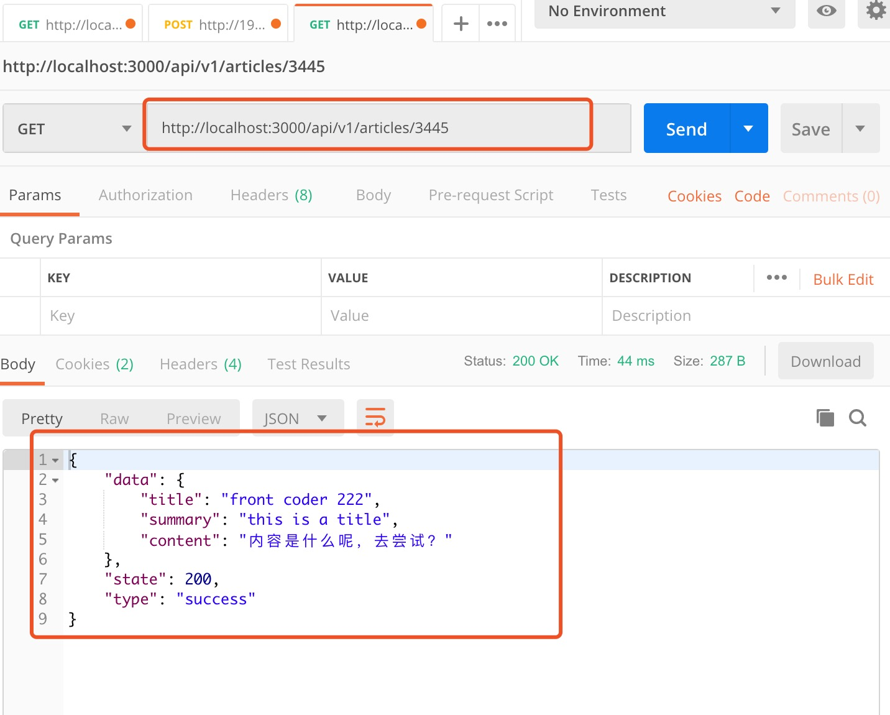

 * @Author: Mr Jiang.Xu 
 * @Date: 2019-09-07 13:41:45 
 * @Last Modified by:   Mr Jiang.Xu 
 * @Last Modified time: 2019-09-07 13:41:45

 
# mock服务平台使用介绍

## 1.启动
``` bash
npm run serve
# 或
yarn serve
```

## 2.使用
在api目录下定义api数据，api下的目录路径和后端api请求保持一致，具体可参考demo

## 3.路由地图
每次新建或者修改路由数据时会自动新建路由映射文件，可以用映射文件去测试请求，格式为 /api/xxx/xxx

## 4.Demo


## 5.使用注意
>前端使用时需保证在同一局域网下，如出现跨域，可参考koa解决跨域问题的module，经测试改服务运行良好，如有疑问和建议，欢迎fork，issue.